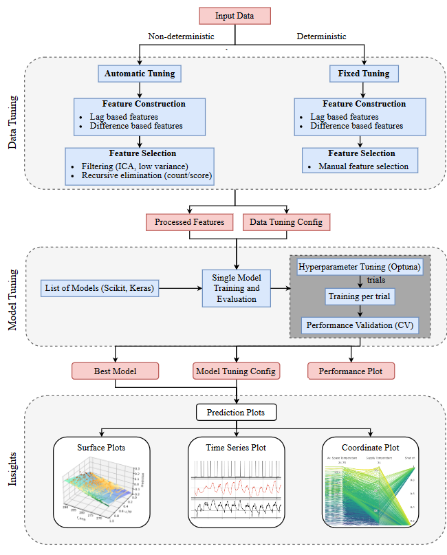

# ADDMo functional overview

__ADDMo is an automated machine learning tool for regression tasks__

__ADDMo faces the following challenges:__

- Preprocessing of initial data (in some extent)
- Selection of proper training and test data periods 
- Selection and creation of optimal features 
- Selection of a model, the model configuration 
- Hyperparameter tuning 
- Overfitting & underfitting 

__The used methods for facing those challenges are:__

Preprocessing:
- Scaling and normalizing: RobustScaler, StandardScaler &
no scaling.

Period selection:
- Time series plotting: Visualization of the signal’s time series
for detecting extraordinary patterns or mistakes in the data
via matplotlib.
- Custom period selection*

Feature creation:

- Creation of differences: Creation of feature derivatives.
- Custom featurelag creation
- Custom ownlag creation

Feature selection:
- Low variance filter: Deletes features with low variance.
- Custom feature selection* of created features.
- Independent component analysis: Separating of superimposed
features.
- Univariate filter: Several search and rating strategies for
univariate filters.
- Embedded recursive feature selection: Embedded multivariate
feature selection using Random Forest where the elimination criteria is set to score or count (features).


Model tuning:
- Model selection: Exhaustive wrapper for selecting the best
out of all implemented models.
- Hyperparameter tuning: via bayesian optimization or grid search
- Cross-validation: prevent overfitting

All those methods are applied sequentially while each method
is optional, thus ensuring that any combination can be selected.

The implemented models are 
- “multi layer perceptron” (ANN) 
- “epsilon support vector regression” (SVR)

The flowchart below depicts the workflow of the tool:  

  

The tool is mainly designed to perform modelling on time series data,
via regression and time series analysis.
Nevertheless it can also be used to handle data indexed by an id, 
simply converting the id into a timestamp (pandas.datetimeindex convention).


Note: The tool is single output only (no MIMO).
It has no natively recurrent model, means it only uses ownlags as a regular input for regression analysis (A native recurrent model would be e.g. long short term memory neural networks)


# How to set it up 

1. Clone the repository  
`git clone https://git-ce.rwth-aachen.de/ebc/ebc-general/machine-learning/addmo-automated-ml-regression.git`


2. Create new environment using venv or conda  

	Using venv:  
	`python3 -m venv .venv`  
	`source .venv/bin/activate`  
	
	Using conda:  
	Open command line and create a python 3.10 or above environment via:
	`conda create --name ADDMo python=3.10 `
	
	Type y for accepting to install first packages:
	` y`
	
	Activate environment:
	`conda activate ADDMo`


3. Change directory in command line to the project path using: `cd <Path to your local ADDMo repo>`


4. Install required packages via:
   `pip install -e .`

	

5. Set the conda environment "ADDMo" as interpreter for e.g. in PyCharm


### Plotting Caution:
Some users might face matplotlib interface errors while executing plotting scripts in GUI, such as not being able to view the plots. If encountering such an error, try downgrading matplotlib to 3.9

# How to use it- two options

#### Option 1: via the GUI
#### Option 2: accessing the python files and run them directly 


__How to use the GUI:__

Executing this command in the terminal where your virtual environment is activated will launch the GUI: addmo-gui

## Functionalities accessible via the GUI:

## Data tuning
### Auto Data Tuning:


Toggle key preprocessing steps like lag creation and difference features and choose between manual or automated feature selection.

Default saving path: `addmo-automated-ml-regression\addmo_examples\results\test_raw_data\data_tuning_experiment_auto`

Detailed configuration guide available directly in the GUI tab.

### Fixed Data Tuning:
Uses the same general fields as the auto tuning tab and supports key feature construction options:
create_lag, create_diff, create_squared

Default saving path: `addmo-automated-ml-regression\addmo_examples\results\test_raw_data\data_tuning_experiment_fixed`

Feature naming convention: Temperature__lag3, Power__diff

Detailed configuration guide available directly in the GUI tab.

## Model tuning 
Importing the previously tuned data, training the model with optimizing the hyperparameters and evaluate the model via out-of-sample predictions. Mention the tuned data path (default or custom) in the config to train model on tuned data.
One can select multiple models for training in the `Models` field under the `Model Tuning Configuration`

Default saving path: `addmo-automated-ml-regression\addmo_examples\results\test_raw_data\test_data_tuning\test_model_tuning`

## Insights
Generate insightful visualizations based on the results of previously trained and saved models. One can generate insights on models trained by ADDMo or external frameworks (only `Scikit` and `Keras` models supported).
One can define bounds and default values for the features manually or select the existing min and max of each feature as bound and mean (numerical features) or mode (categorical features) as default values.

## Testing
Test a previously trained and saved model using new or unseen input data and predict and evaluate the model with a more sophisticated evaluation method.\
`Select Tuning Type`: This is critical if the model was trained on tuned data. Specify the tuning type and the path where the tuned data file is saved. The file is loaded to recreate the data tuning automatically. 
This way the model is trained and tested on the same features and ensures the tuning type and input structure match the training phase!

## Recreate Data Tuning
Allows recreating the exact data tuning process applied during a previous experiment, using the saved tuning configuration.
This step is handled already in the `Testing` tab. This tab only supports tuning configurations saved by this app.
It cannot recreate tuning from externally trained models or configurations.

## Running the scripts directly via the python console:

These execution files works exactly like the GUI tabs. In order to perform specific functionalities, change the saved config.json file under
each config tab in the ADDMo folder.  
For example: For changing the config for `Auto Data Tuning`, change the file here: `addmo-automated-ml-regression\addmo\s1_data_tuning_auto\config\data_tuning_auto_config.json`

*Executive scripts are:*
- `exe_data_tuning_auto.py` for automatically tuning the data. 
- `exe_data_tuning_fixed.py` for tuning the data in a fixed manner.
- `exe_model_tuning.py` for training a list of models and saving the best performing model.
- `exe_data_insights.py` for generating several insightful plots for interpreting the model performance.
- `exe_model_testing.py` for predicting new data values on trained model.
- `exe_recreate_data_tuning.py` for recreating the same features on new data based on saved tuned data

-------------------------------------------

__Information about the required input shape:__
- Input ExcelFile has to be named: "InputData" and saved in the Folder `addmo_examples/raw_input_data`
- Sheet to read in must be the first sheet, with time as first column and all signals and features thereafter (one per column)
- The time must be in the format of "pandas.datetimeindex". If the time is in seconds, convert it into DD-MM-YY format.
- Columns must have different names
- By default, the delimiter for csv files is `;`. Explicitly change it under the exe_data_insights in case of different delimiters.

__Understanding the handling of saving the results:__\
A folder called results is created within the directory (`addmo-automated-ml-regression\addmo_examples`) of the python files. Within that folder a four layered folder system is used, the next layer is a subfolder of the respective previous layer. The folder are created by the program, only their names must be defined:
- Layer0: `Results`: general folder for all results
- Layer0: `raw_input_data`: name of the folder used to declare which input data is used for the results within.
- Layer1: `name_of_raw_data`: name of the folder in which the results of all executions for a particular run are saved, including the "Data Tuning" which will be the input for model tuning. "Model Tuning" and "Data Insights" results are saved as different folders under this folder.
- Layer2: `name_of_tuning`: name of the folder in which the results of "Data Tuning" are saved. 
- Layer2: `name_of_data_tuning_experiment`: name of folder in which different "Model Tuning" experiment folders are created. This folder helps in keeping track of which model tuning is used for a specific dataset and helps you create multiple experiments using different models but the using the same tuned data. 
- Layer3: `name_of_model_tuning_experiment`: name of folder in which results of "Model Tuning" are saved.
- Layer4: `plots`: name of the folder in which the results of plotting are saved.  

An example of how the structure looks like:  
``` 
addmo_examples/  
└── raw_input_data/ 
└── results/  
	└── test_raw_data/             # name_of_raw_data
        	└── data_tuning_experiment_fixed/      # name_of_tuning (tuned data is stored here)
        	└── test_data_tuning_fixed/     # name_of_data_tuning_experiment (models trained on fixed tuned data is stored here)
                	└── ScikitMLP_fixed_tuning/        # name_of_model_tuning_experiment (all files regarding a specifc trained model)
                 		└── plots/        # plots generated using ScikitMLP are stored here
			└── SciKeras_fixed_tuning/
				└── plots/
```

# Cite ADDMo:

If you use ADDMo in scientific publication, we would appreciate citations to the following paper:

Automated data-driven modeling of building energy systems via machine learning algorithms, Rätz et al., Energy and Buildings, Volume 202, 2019.

Published at Energy&Buildings Journal:
[Link to article](https://doi.org/10.1016/j.enbuild.2019.109384 )

If you are not granted access to the paper, you may find the pre-print at:
[Link to pre-print article at researchgate](https://www.researchgate.net/publication/335424562_Automated_Data-driven_Modeling_of_Building_Energy_Systems_via_Machine_Learning_Algorithms)
